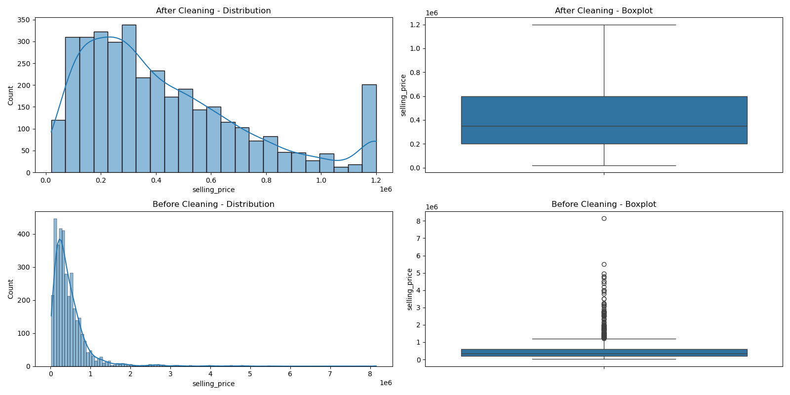
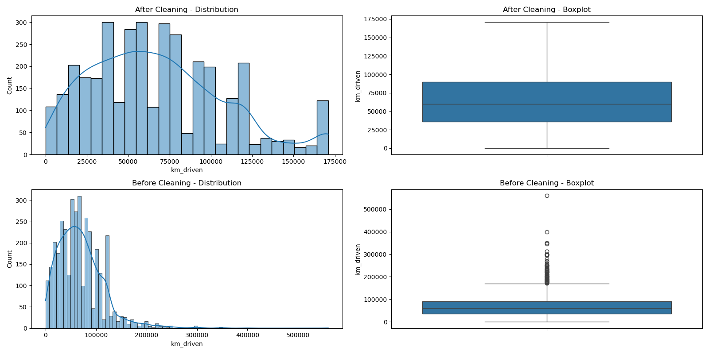
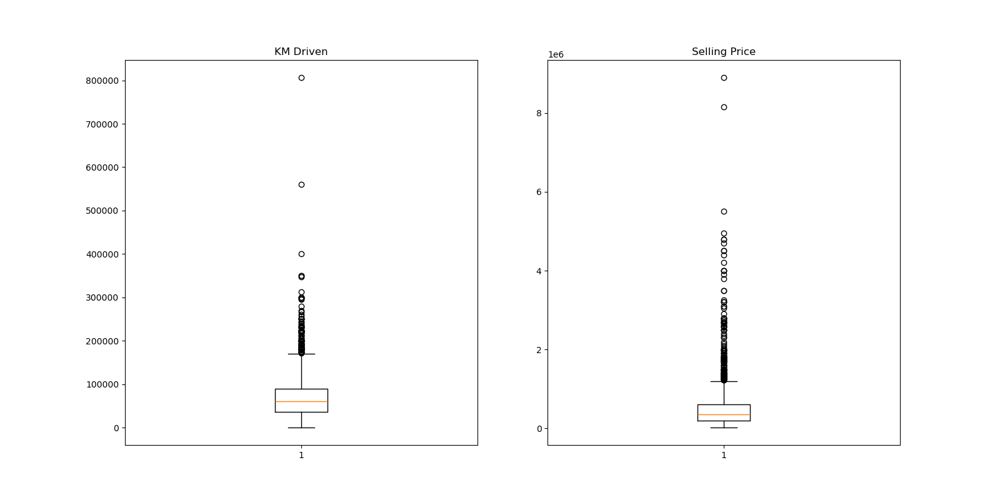

# 🚗 Car Price Prediction with Machine Learning | OIBSIP Task 3

## 📌 Objective
Predict the resale value of used cars based on historical market data (mileage, age, brand, fuel type, transmission, etc.) to help dealerships and buyers estimate fair market prices.

---

## 📁 Dataset
- **Source:** CAR DETAILS FROM CAR DEKHO
- **Records:** 4,340 raw listings (after cleaning)
- **Key Columns:** Car Name, Year, Selling Price, KM Driven, Fuel Type, Seller Type, Transmission, Owner
- **Target Variable:** Selling Price (₹)

---

## 🧹 Data Cleaning
- Removed duplicate records
- Detected and capped outliers using IQR method on `selling_price` and `km_driven`
- Maximum selling price capped to ~₹1.2M, extreme-high-mileage cars bounded
- Distribution shifts confirmed via before/after density plots

### Selling Price Distribution (After Outlier Treatment)


### KM Driven Distribution


### Outlier Detection — Box Plots


---

## 🔧 Feature Engineering
- **Brand extraction:** Extracted manufacturer brand from car name column
- **Car age calculation:** Derived `car_age` from the year column
- **Categorical encoding:** Applied encoding to Fuel Type, Transmission, Seller Type, and Owner columns

---

## 🔍 EDA — Key Findings

### Selling Price vs Car Age


### Correlation Matrix


**Key Observations:**
- **Newer cars** = **Higher price** — strong negative correlation between car age and price
- **Diesel cars** fetch **more money** than petrol equivalents
- **Automatic transmission** holds significantly more value in the resale market
- **Older cars** tend to have **more owners** and higher mileage

---

## 🤖 Models Trained

Three regression models were evaluated:

| Model | MAE | MSE | RMSE | R² |
|---|---|---|---|---|
| Linear Regression | 0.2987 | 0.1456 | 0.3815 | 0.7606 |
| **Random Forest** | **0.2840** | **0.1333** | **0.3652** | **0.7807** |
| XGBoost | 0.2875 | 0.1388 | 0.3725 | 0.7717 |

### Model Performance Comparison


---

## 🏆 Selected Model: XGBoost

- **R² Score:** 0.7717 — explains **77.17% of variance** in selling price
- **RMSE:** 0.3725
- **MSE:** 0.1388
- Selected as the final model based on its robust performance and fast inference speed

### Top Feature Importances (XGBoost)
1. **Vehicle Age (15.7%)** — The single most dominant factor. Depreciation hits hardest.
2. **Brand: Toyota (12%)** — Market prices in a "reliability premium" for Toyota
3. **Transmission (11%)** — Automatic transmissions hold significantly more resale value

**Conclusion:** For a dealership or seller, sourcing newer, automatic Toyotas will yield the highest consistent resale margins.

---

## 💡 Key Insights
1. **XGBoost outperforms** Linear Regression and Random Forest for used car price prediction
2. **Vehicle age is the #1 predictor** — depreciation dominates all other factors
3. **Toyota commands a brand premium** in the resale market (~12% feature importance)
4. **Automatic transmission** adds significant resale value over manual
5. **Outlier capping was essential** — raw data had extreme luxury vehicles skewing the distribution

---

## 📂 Project Files

```
📁 DataScience-Task3-CarPricePrediction/
├── Notebook.ipynb                     → Complete ML pipeline notebook
├── CAR DETAILS FROM CAR DEKHO.csv     → Dataset
├── images/                            → All visualizations (6 plots)
└── README.md                          → Project documentation
```

---

## 🛠️ Tech Stack


| Library | Purpose |
|---|---|
| `pandas` | Data loading, cleaning, manipulation |
| `numpy` | Numerical operations |
| `matplotlib` | Plotting and visualization |
| `seaborn` | Statistical visualizations |
| `scikit-learn` | Linear Regression, Random Forest, metrics |
| `xgboost` | XGBoost Regressor |

---

## 🚀 How to Run

```bash
# 1. Clone or download the project
# 2. Install dependencies
pip install numpy pandas matplotlib seaborn scikit-learn xgboost

# 3. Open the notebook in Jupyter
jupyter notebook Notebook.ipynb
```

---

*Submitted as part of OIBSIP (OASIS InfoByte Internship Program) — Data Science Task 3*


---

## 🚀 Full-Stack Application Upgrade

This repository has been upgraded from a Jupyter Notebook experiment into a **production-ready full-stack application**.

### Backend (FastAPI)
- **API Endpoints:** /predict, /scenario, /model-info, /model-comparison, /data-quality
- **ML Pipeline:** The complete scikit-learn ColumnTransformer + Pipeline is pickled, allowing the API to accept raw JSON inputs without manual feature engineering.
- **Validation:** Pydantic models validate all incoming requests.

### Frontend (React + Vite)
- **Modern UI:** Built with Tailwind CSS v4 and Lucide React featuring a compact, glassmorphism dark theme.
- **Interactive Predictor:** Real-time form with dropdowns dynamically populated from the ML metadata.
- **Scenario Simulator:** Compare up to 4 different car configurations side-by-side with automatic charting.
- **Model Insights:** Visualizes CV metrics and actual vs. predicted performance directly in the UI.

### Deployment & DevOps
- **Docker:** Dockerfile and docker-compose.yml for instant local deployment.
- **CI/CD:** GitHub Actions workflow for automated testing and builds.
- **Render:** Included render.yaml for one-click cloud deployment.

### How to Run Locally (Full-Stack)

1. **Start the Backend API:**
   ```bash
   $env:PYTHONPATH="backend"
   python -m uvicorn backend.app.main:app --port 8001 --reload
   ```
2. **Start the Frontend UI:**
   ```bash
   cd frontend
   npm install
   npm run dev
   ```
